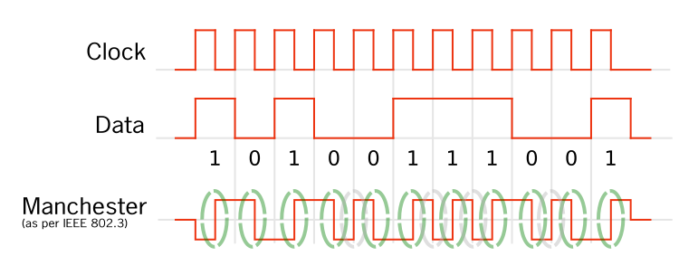

# Interface Ethernet

Esta é uma versão preliminar da prática. Em ofertas futuras da disciplina, pretendemos desenvolver uma placa de rede completa, capaz de enviar e receber quadros e lidar com problemas de acesso ao meio, como colisão.

Mas por hora, a prática vai focar apenas na decodificação dos sinais obtidos de uma mídia Ethernet 10baseT. Esses sinais foram gravados por um [analisador lógico improvisado](https://github.com/thotypous/tangnano9k-bsv-uart-test/tree/analyzer) com a entrada LVDS da Tang Nano 9k. Implementamos uma máquina de estados simples em hardware que espera os primeiros ciclos do preâmbulo para disparar o *trigger* do analisador lógico e, a partir desse momento, coletamos uma quantidade fixa de amostras a 81 MHz. Ou seja, **o sinal que vamos processar já está padronizado com uma fase constante com relação ao início do quadro**.

Preencha seu código no arquivo [eth10M.py](eth10M.py).

## Decodificação Manchester

O primeiro passo para decodificar o sinal é realizar a decodificação Manchester. A figura abaixo, adaptada do [artigo da Wikipedia](https://en.wikipedia.org/wiki/Manchester_code), ilustra esse problema.

São transmitidos 10Mbit/s no meio físico, com um símbolo por bit. Como nosso analisador lógico adquire o sinal a uma taxa de 81 MHz, cada símbolo corresponde a aproximadamente 8 amostras, mas essa quantidade de amostras pode variar entre 7 e 9 por conta da diferença entre os relógios do transmissor e do receptor.

Na amostra central do símbolo (representada pelo tracejado verde na figura), **sempre** ocorre uma transição do sinal. Essa transição é de 0 para 1 se o bit original for 1, ou de 1 para 0 se o bit original for 0. Nosso decodificador deve localizar essas transições e produzir um bit de saída para cada uma delas.

Na amostra inicial do símbolo, pode ocorrer uma transição que devemos ignorar (ou seja, não devemos produzir saída nenhuma quando ela acontecer). Essas transições acontecem sempre que há sequências de bits iguais na entrada original, e estão representadas pelo tracejado cinza na figura.

Em resumo, o decodificador deve sincronizar sua fase em todas as transições (tanto nas contornadas por verde quanto nas contornadas por cinza), mas deve produzir saída apenas nas transições representadas por verde (quando a fase indicar que estamos no meio de um símbolo).

## Alinhamento com o primeiro byte do quadro

Podem ocorrer pequenas variações no tempo de resposta do detector de preâmbulo. Por isso, o sinal que vamos decodificar pode começar em partes diferentes do preâmbulo, pulando uma quantidade variável de bits.

Para resolver esse problema, vamos descartar o preâmbulo e o SFD, produzindo como saída do decodificador apenas os bytes a partir do primeiro byte do endereço MAC de destino. Para visualizar melhor a parte do sinal que deve ser descartada, consulte o artigo sobre [quadro Ethernet na Wikipedia](https://en.wikipedia.org/wiki/Ethernet_frame#Structure).

Os bits iniciais obtidos após a decodificação Manchester serão, portanto, bits 0 e 1 alternados, pois fazem parte do preâmbulo. Quando encontrarmos os bits 1 e 1 seguidos, significa que chegamos ao final do SFD. Devemos começar a juntar os bits seguintes a esses bits finais do SFD em grupos de 8 bits e produzir os bytes correspondentes como saída.

## Testando seu código

Execute `./run-grader`.

Se algum das saídas produzidas pelo seu código estiver errada, será mostrada uma comparação entre a saída produzida por você (à esquerda) e a saída esperada (à direita).
