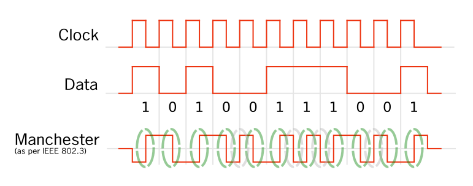
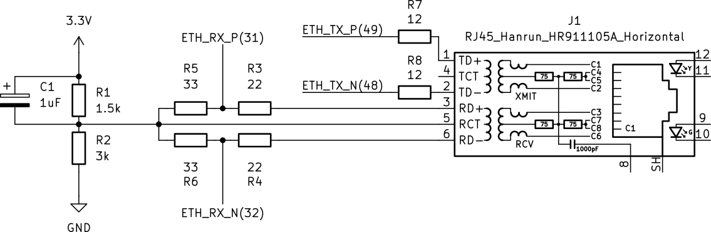

# Interface Ethernet 10baseT

Nesta prática, vamos transformar a FPGA em uma pequena placa de rede [Ethernet 10baseT](https://en.wikipedia.org/wiki/10BASE-T). A lógica recebe quadros Ethernet diretamente dos sinais elétricos do par diferencial, decodifica Manchester, localiza o início do quadro, envia os bytes recebidos pela UART e transmite respostas ARP simples para participar de uma rede real. O projeto não bufferiza quadros inteiros nem oferece uma interface de envio genérica para o computador, mas implementa o caminho físico de recepção e transmissão necessário para conversar com uma placa Ethernet comum.

Além da recepção, o transmissor deve respeitar a ocupação do meio compartilhado. Antes de transmitir, ele aguarda o canal ficar livre; durante a transmissão, ele detecta colisões, envia uma sequência de jam e tenta novamente após um intervalo de backoff. Esses mecanismos são a base do CSMA/CD usado no Ethernet half-duplex clássico.

## Dependências

No Arch Linux, utilize os pacotes a seguir obtidos do [AUR](https://aur.archlinux.org) ou precompilados do [Chaotic AUR](https://aur.chaotic.cx):

```bash
sudo pacman -S bluespec-git bluespec-contrib-git yosys-git nextpnr-git prjapicula verilator openfpgaloader
```

Se você usa outra distribuição, prefixe todos os comandos descritos neste documento com `./run-docker` para executá-los dentro de um container.

## Síntese e Testes

Para sintetizar a lógica para FPGA, execute:

```bash
make
```

Para carregar o bitstream em uma Tang Nano 9k, execute:

```bash
make load
```

Para executar os testes automatizados, use:

```bash
./run-grader
```

Os testes de recepção leem sequências de bits da entrada padrão e comparam a saída com arquivos de referência. Os testes de transmissão instanciam o transmissor em simulação e verificam diretamente os sinais gerados, o respeito ao canal ocupado, a detecção de colisão, o jam e o backoff.

## Implementação

As partes que devem ser implementadas estão marcadas com `TODO` no código. Os registradores já declarados em cada módulo são sugestões de estado interno; você pode alterá-los se preferir outra organização.

### ManchesterDecoder

Implemente o módulo [mkManchesterDecoder](ManchesterDecoder.bsv), que recebe o fluxo de amostras produzido pelo [mkFrameDelimiter](FrameDelimiter.bsv) e produz os bits decodificados por Manchester.



Os dados em uma rede 10baseT são transmitidos a 10 Mbit/s. Como nosso sinal é amostrado a 81 MHz, cada bit de dados corresponde a aproximadamente 8 amostras (`81 MHz / 10 Mbit/s ≈ 8.1`). Pequenas diferenças entre os clocks do transmissor e do receptor podem fazer com que essa quantidade varie entre 7 e 9 amostras.

Na região central de cada símbolo Manchester sempre ocorre uma transição. Essa transição é de `0` para `1` quando o bit transmitido é `1`, ou de `1` para `0` quando o bit transmitido é `0`. Também podem existir transições na fronteira entre símbolos consecutivos; essas transições servem para manter o alinhamento, mas não correspondem a novos bits.

Uma forma prática de implementar o decodificador é manter uma estimativa da fase dentro do símbolo. A cada amostra válida, compare o valor atual com o valor anterior para detectar transições. Quando uma transição for observada perto da metade esperada do símbolo, ela deve gerar um bit decodificado. Quando a transição acontecer perto da fronteira entre símbolos, ela deve apenas realinhar a fase, sem gerar saída.

Em resumo, seu decodificador deve:

1. Acompanhar o valor anterior da linha para detectar transições.
2. Manter uma noção de fase para distinguir transições de meio de símbolo de transições entre símbolos.
3. Realinhar essa fase sempre que uma transição for observada, tolerando pequenas variações no número de amostras por bit.
4. Emitir exatamente um bit decodificado para cada símbolo Manchester recebido.

O módulo deve emitir `Valid(bit)` para cada bit decodificado. Quando receber `Invalid`, que marca o fim de um quadro, deve reiniciar seu estado interno e repassar `Invalid` para a saída.

[Neste link](https://github.com/ctf-br/ctf-sbseg2024/blob/5e625e52c7160c92b9695fac49d095c96c595d08/seized_photos/private/solver/solve.py#L57-L89) há uma implementação em Python similar ao que este módulo de hardware deve implementar.

### SFDLocator

Implemente o módulo [mkSFDLocator](SFDLocator.bsv), que recebe os bits decodificados pelo `mkManchesterDecoder` e localiza o fim do Delimitador de Início de Quadro, ou SFD (*Start Frame Delimiter*).

Um quadro Ethernet começa com:

- **Preâmbulo:** 7 bytes com padrão alternado de bits, usado para sincronização.
- **SFD:** 1 byte que encerra a sincronização e marca o início do quadro Ethernet propriamente dito.

Os bits chegam ao `mkSFDLocator` já decodificados e na ordem em que aparecem no fio. Durante o preâmbulo, o fluxo observado é alternado. O SFD tem o mesmo padrão alternado no começo, mas termina com dois bits `1` consecutivos. Esse par de `1`s marca que o próximo bit recebido já é parte dos "dados úteis" do quadro Ethernet.

Uma forma simples de implementar o localizador é acompanhar o bit anterior enquanto o SFD ainda não foi encontrado. Antes do SFD, nenhuma saída deve ser produzida. Ao reconhecer o fim do SFD, o módulo passa para um estado em que todo `Valid(bit)` recebido é encaminhado para a saída.

Em resumo, seu localizador deve:

1. Ignorar os bits de preâmbulo e SFD.
2. Detectar o fim do SFD no fluxo decodificado.
3. Encaminhar todos os bits válidos que vierem depois do SFD.
4. Ao receber `Invalid`, encerrar o quadro atual, repassar `Invalid` para a saída e voltar a procurar o SFD do próximo quadro.

### EthernetTx

Implemente os trechos marcados com `TODO` em [mkEthernetTx](EthernetTx.bsv). O quadro transmitido já é montado pelo código fornecido; o objetivo desta prática é completar a codificação física e o comportamento de acesso ao meio.

O transmissor deve codificar cada bit como um símbolo Manchester nos pinos `eth_tx_p` e `eth_tx_n`. Esses pinos formam um par diferencial lógico: durante uma transmissão, eles devem ter valores opostos.

Antes de iniciar uma transmissão, o módulo deve observar `rxActivity`, que indica atividade detectada no receptor. Se o canal estiver ocupado, ou se ainda não tiver permanecido livre pelo intervalo mínimo entre quadros, o transmissor deve permanecer em silêncio.

O sinal `rxActivity` vem do módulo [mkRxActivityDetector](RxActivityDetector.bsv). Como o AFE desta prática é propositalmente simples, esse detector não mede energia analógica do sinal como uma placa Ethernet comercial normalmente faria. Em vez disso, ele procura padrões temporais compatíveis com Manchester para evitar que o piso de ruído seja interpretado como atividade real de recepção.

Se `rxActivity` indicar atividade enquanto uma transmissão local está em andamento, o transmissor deve tratar o evento como colisão. O código fornecido já calcula o intervalo de backoff; complete o comportamento para aguardar esse intervalo antes de tentar transmitir novamente.

## Teste de Bancada

O teste de bancada usa a FPGA como uma interface Ethernet 10baseT simples. Ela recebe quadros do meio físico, imprime os bytes recebidos pela UART e responde a requisições ARP para o endereço IP `10.1.2.3` com o endereço MAC `de:ad:be:ef:ca:fe`.



### Montagem

Conecte o circuito do AFE à Tang Nano 9k conforme o diagrama. Para observar recepção e transmissão com colisões reais, use um hub Ethernet 10baseT half-duplex. Um switch Ethernet comum normalmente não serve para esse experimento, pois isola domínios de colisão.

Configure um computador no mesmo segmento Ethernet com IP fixo, por exemplo `10.1.2.2/24`. Substitua `enp5s0` nos comandos abaixo pelo nome da sua interface de rede.

### UART

Antes de carregar o bitstream, configure a UART da Tang Nano 9k e deixe o terminal aberto:

```bash
stty -F /dev/ttyUSB1 3000000 cs8 -parenb cstopb
picocom -b 3000000 -d 8 -p 1 -y n /dev/ttyUSB1
```

Em outro terminal, carregue a FPGA:

```bash
make load
```

Para visualizar os bytes recebidos em hexadecimal, feche o picocom com `Ctrl+a` seguido de `Ctrl+q` e execute:

```bash
hexdump -C /dev/ttyUSB1
```

### ARP

Com a FPGA carregada, envie uma única requisição ARP para o IP implementado pelo projeto:

```bash
sudo arping -c1 -I enp5s0 10.1.2.3
```

A FPGA deve receber o quadro ARP, imprimir seus bytes pela UART e transmitir uma resposta ARP. O `arping` deve indicar uma resposta vinda de `de:ad:be:ef:ca:fe`.

Para observar várias respostas ARP em sequência, execute o `arping` sem limitar o número de pacotes:

```bash
sudo arping -I enp5s0 10.1.2.3
```

Uma saída típica é:

```text
ARPING 10.1.2.3 from 10.1.2.2 enp5s0
Unicast reply from 10.1.2.3 [DE:AD:BE:EF:CA:FE]  0.708ms
Unicast reply from 10.1.2.3 [DE:AD:BE:EF:CA:FE]  0.725ms
Unicast reply from 10.1.2.3 [DE:AD:BE:EF:CA:FE]  0.713ms
^CSent 3 probes (1 broadcast(s))
Received 3 response(s)
```

### Tráfego UDP

Se o transmissor ainda não estiver funcionando, a recepção pode ser testada mesmo assim cadastrando manualmente a entrada ARP esperada no computador:

```bash
sudo arp -s 10.1.2.3 de:ad:be:ef:ca:fe
```

Se o transmissor estiver funcionando, o próprio sistema operacional deve resolver o endereço MAC da FPGA por ARP quando o tráfego UDP for enviado. Se o transmissor ainda não estiver funcionando, use a entrada ARP manual acima. Em seguida, inicialize o ambiente Python e execute o gerador de tráfego no diretório `software`:

```bash
poetry install --no-root
```

Depois execute:

```bash
poetry run python sender.py
```

As mensagens transmitidas pelo computador devem aparecer dentro dos quadros observados na UART.

### CSMA/CD

Para testar CSMA/CD, conecte dois computadores e a FPGA ao mesmo hub 10baseT. Em um computador, deixe o `arping` contínuo:

```bash
sudo arping -I enp5s0 10.1.2.3
```

No outro computador, gere tráfego intenso no mesmo domínio de colisão:

```bash
sudo arp-scan -i 1u -I enp3s0 10.1.2.0/24
```

Durante o `arp-scan`, o LED de colisão do hub deve acender em alguns momentos. Mesmo assim, o `arp-scan` deve encontrar o outro computador e a FPGA, e o `arping` deve continuar recebendo respostas. Ao interromper o `arping` com `Ctrl+C`, confira se os contadores `Sent` e `Received` permanecem iguais ou muito próximos; isso indica que carrier sense, collision detect, jam, backoff e retry estão funcionando em conjunto.

## Troubleshooting

O template já monta o quadro ARP no formato esperado e calcula o FCS corretamente. Portanto, se sua implementação de transmissão passa nos testes unitários, não é esperado que você tenha problemas de FCS no teste de bancada.

A dica abaixo é útil apenas se você fizer mudanças mais profundas no transmissor, por exemplo para preparar uma demonstração diferente para o seminário final da disciplina. Nesse caso, se a placa de rede do computador estiver descartando quadros antes que eles cheguem ao Wireshark ou ao tcpdump, pode ser difícil observar quadros com FCS incorreto. Para pedir que a interface entregue também esses quadros ao sistema operacional, tente habilitar `rx-fcs` e `rx-all`:

```bash
sudo ethtool -K enp5s0 rx-fcs on rx-all on
```

Nem todas as placas ou drivers suportam essas opções. Verifique os recursos disponíveis com:

```bash
sudo ethtool -k enp5s0
```
